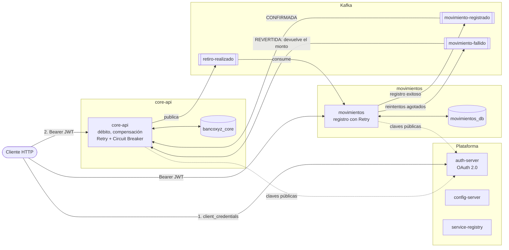

# BancoXYZ: microservicios seguros, resilientes y en contenedores (Exp3 S8)

**Actividad sumativa individual.** Autor: Diego Cruz

Este proyecto continúa el trabajo grupal del Grupo 11 en las semanas 6 y 7 (Config Server, Eureka, saga con Kafka y el microservicio movimientos). En la semana 8 se agregaron de forma individual:

- Servidor de autorización **OAuth 2.0** (`auth-server`) y protección de core-api y movimientos como *resource servers*, con autorización por scopes.
- **Imágenes Docker** de todos los servicios y un **`docker-compose.yaml`** que orquesta la solución completa.
- **Resilience4j en core-api** (Retry, Circuit Breaker y compensación local), que cierra un hueco de consistencia en la publicación del retiro.
- Endpoint de consulta en movimientos (`GET /api/movimientos`).

Las evidencias de ejecución (figuras 1 a 12) están en el PDF de evidencias incluido en la carpeta de entrega.

## Objetivo

Simulación bancaria construida con microservicios Spring Boot que se comunican mediante eventos en Kafka. El caso implementado es el **retiro de dinero**: core-api descuenta el saldo y el microservicio movimientos lo registra en su propia base de datos; si movimientos no puede registrarlo, core-api **compensa** devolviendo el monto. Toda la solución corre en contenedores, el acceso a las APIs está protegido con OAuth 2.0 y ambos microservicios toleran la caída de sus dependencias.

## Arquitectura

| Servicio | Puerto | Responsabilidad |
|---|---|---|
| `config-server` | 8888 | Configuración centralizada (Spring Cloud Config, archivos en `config-repo/`, con perfil `docker`) |
| `service-registry` | 8761 | Registro y descubrimiento de servicios (Eureka) |
| `auth-server` | 9000 | Servidor de autorización OAuth 2.0: emite tokens JWT firmados |
| `core-api` | 8080 (HTTPS) | Cuentas y retiros. Inicia la saga y ejecuta la compensación |
| `movimientos` | 8081 (HTTPS) | Registra cada retiro en su propia base de datos y permite consultarlos |
| `kafka` + `kafka-init` | 9092 | Kafka 4.2 (KRaft); `kafka-init` crea los tópicos y termina |
| `postgres-core` | 5434 | Base de datos de core-api (`bancoxyz_core`) |
| `postgres-movimientos` | 5433 | Base de datos de movimientos (`movimientos_db`) |

Los puertos indicados son los publicados en el equipo. Los contenedores en ejecución, el arranque de cada servicio y su registro en Eureka se muestran en las figuras 1, 2 y 3. Dentro de la red de Docker, cada servicio se alcanza por su nombre (por ejemplo, `kafka:29092` o `postgres-core:5432`).

Tecnologías: Java 21, Spring Boot 4.1, Spring Security 7 (servidor de autorización y resource server), Spring Cloud 2025.1, Spring Kafka 4.1, Resilience4j 2.3, Flyway, PostgreSQL 18 y Docker Compose.

Cada microservicio tiene su propia base de datos. Las tablas se crean y los datos iniciales se cargan con migraciones Flyway al arrancar cada servicio.



core-api y movimientos obtienen su configuración del Config Server y se registran en Eureka; esas conexiones se omiten en el diagrama para que sea legible.

## Seguridad: OAuth 2.0

### Flujo

Se usa el flujo **client credentials**, el que corresponde a comunicación entre sistemas sin un usuario final que inicie sesión (la solución no tiene interfaz de usuario):

1. El cliente se autentica ante `auth-server` con su id y secreto, y pide los scopes que necesita.
2. `auth-server` emite un **JWT firmado** (RS256) con los scopes autorizados y 5 minutos de vigencia (figura 5).
3. El cliente llama a core-api o movimientos con la cabecera `Authorization: Bearer <token>`.
4. Cada microservicio valida el token **por sí solo**: la firma (con las claves públicas que publica `auth-server`), la vigencia, el emisor y los scopes. Los microservicios nunca conocen los secretos de los clientes.

`auth-server` no tiene clases de configuración: Spring Boot autoconfigura el servidor de autorización a partir de las propiedades de `auth-server/src/main/resources/application.properties`, donde están registrados los clientes.

### Clientes y scopes

| Cliente | Representa | Scopes |
|---|---|---|
| `cliente-consulta` | Aplicación de solo lectura (reportes) | `cuentas.leer`, `movimientos.leer` |
| `cliente-cajero` | Canal que opera dinero | `cuentas.leer`, `cuentas.retirar` |
| `cliente-monitoreo` | Operaciones | `monitoreo` |

Cada cliente recibe solo los permisos que su función requiere (mínimo privilegio): el cajero puede retirar pero no consultar movimientos, y la aplicación de reportes puede leer pero no retirar. `auth-server` rechaza (`invalid_scope`) cualquier solicitud de un scope que el cliente no tiene asignado.

### Reglas de acceso

| Servicio | Endpoint | Exige |
|---|---|---|
| core-api | `GET /api/cuentas`, `GET /api/cuentas/{id}`, `GET /api/transacciones` | `cuentas.leer` |
| core-api | `PATCH /api/cuentas/{id}/retiro` | `cuentas.retirar` |
| movimientos | `GET /api/movimientos?cuentaId={id}`, `GET /api/movimientos/{idOperacion}` | `movimientos.leer` |
| ambos | `/actuator/health` | Público (lo usan los healthchecks de Docker); los detalles solo con `monitoreo` |
| ambos | `/actuator/info`, `/actuator/metrics` | `monitoreo` |
| ambos | Cualquier otra ruta | Denegada |

| Situación | Respuesta |
|---|---|
| Sin token, o token vencido, mal formado o con firma inválida | `401` con cabecera `WWW-Authenticate: Bearer` |
| Token válido pero sin el scope requerido | `403` con `error="insufficient_scope"` |

Las figuras 6 y 7 muestran estas reglas en core-api y movimientos con los tres clientes, y la figura 8 el comportamiento de `/actuator/health` con y sin token.

Las reglas se definen por URL en la cadena de filtros de Spring Security (`SecurityConfig` de cada servicio), no con `@PreAuthorize`. Así, una denegación se resuelve en el filtro de seguridad, antes de llegar al controlador; en core-api esto es necesario porque `GlobalExceptionHandler` atrapa toda `Exception` y convertiría una denegación lanzada en el controlador en un error 500.

### Emisor fijo de los tokens

Cada JWT incluye su emisor (`iss`), y los microservicios lo comparan con el que tienen configurado. Por defecto, el emisor depende de la URL con que se pidió el token: desde el equipo sería `http://localhost:9000`, pero dentro de la red de Docker el servidor se llama `auth-server:9000`, y la validación fallaría. Por eso el emisor está **fijado explícitamente**: `http://auth-server:9000` en Docker (variable `AUTH_ISSUER`) y `http://localhost:9000` en ejecución local. Así, un token pedido desde el equipo es aceptado por los microservicios dentro de Docker.

## Contenedores

### Imágenes

Cada servicio tiene su `Dockerfile` en su carpeta, con el mismo esquema:

- **Construcción en dos etapas.** La primera compila con JDK 21 y el wrapper de Maven del proyecto (misma versión de Maven que en desarrollo); la segunda contiene solo el JRE 21 y el JAR. El JDK, Maven y el código fuente no quedan en la imagen final.
- **Caché de dependencias.** El `pom.xml` se copia y sus dependencias se descargan en una capa propia, antes del código: cambiar una clase no vuelve a descargar las dependencias.
- **Usuario sin privilegios.** El proceso no corre como root.

El contexto de construcción es la raíz del repositorio (para usar el wrapper de Maven); `.dockerignore` excluye compilados, Git y archivos del IDE.

### Orquestación (`docker-compose.yaml`)

- **Construye y levanta todo con un comando**, incluidas las bases de datos y Kafka.
- **Orden de arranque con healthchecks reales**, no solo "contenedor iniciado": core-api y movimientos esperan a que el Config Server sirva configuración, Eureka responda, `auth-server` publique sus metadatos OAuth, su base de datos acepte conexiones y `kafka-init` haya creado los tópicos.
- **Reinicio automático** (`restart: unless-stopped`) de los servicios Spring ante una caída.
- **Configuración específica de Docker en el Config Server** (figura 4): los archivos `*-docker.properties` del `config-repo` sobrescriben solo lo que cambia dentro de la red (direcciones de base de datos, Kafka, Eureka y emisor de tokens). La URL del Config Server se recibe por la variable `CONFIG_SERVER_URL`, con `localhost` como valor por defecto, de modo que el mismo código también corre fuera de Docker.

## Arquitectura de eventos

### Patrón elegido: saga coreografiada con compensación

Una **saga** reemplaza una transacción que abarca varios servicios por una secuencia de transacciones locales, una por servicio, conectadas por eventos. Si un paso falla, se ejecuta una **transacción compensatoria** que deshace lo hecho en los pasos anteriores. En la variante **coreografiada** no hay un servicio central que dirija el flujo: cada servicio reacciona a los eventos que le interesan y publica los suyos.

- **El retiro involucra dos servicios con bases de datos separadas**, así que no existe una transacción que abarque ambas; la consistencia se logra con compensación.
- **Coreografía en vez de orquestación:** con dos servicios y un solo flujo, un orquestador sería un servicio adicional sin beneficio real. La desventaja de la coreografía es que el flujo se vuelve difícil de seguir cuando crece; con este tamaño no es un problema.
- **Kafka como canal:** los eventos quedan guardados; si movimientos está caído, el retiro no se pierde y se procesa cuando vuelve.

**Por qué no Event Sourcing:** obligaría a reconstruir el saldo de cada cuenta a partir de sus eventos y a rediseñar cómo core-api guarda las cuentas. Para coordinar un retiro entre dos servicios, la saga resuelve el problema con un cambio mucho menor.

### Flujo

| # | Paso | Servicio |
|---|---|---|
| 1 | Descuenta el saldo, guarda la operación como `PENDIENTE` y publica `retiro-realizado` (esperando la confirmación de Kafka) | core-api |
| 2 | Registra el movimiento en su base de datos | movimientos |
| 3a | Si lo logra, publica `movimiento-registrado`, y core-api marca la operación como `CONFIRMADA` | movimientos → core-api |
| 3b | Si falla tras agotar los reintentos, publica `movimiento-fallido`, y core-api **devuelve el monto** y marca la operación como `REVERTIDA` | movimientos → core-api |

core-api solo cambia el estado de una operación si sigue `PENDIENTE`: si un evento llega repetido, se ignora y el monto nunca se devuelve dos veces. movimientos descarta los retiros duplicados usando el id de operación como clave única.

### Tópicos y eventos

| Tópico | Particiones | Productor | Consumidor | Contenido |
|---|---|---|---|---|
| `retiro-realizado` | 3 | core-api | movimientos | `idOperacion`, `cuentaId`, `monto`, `fechaHora` |
| `movimiento-registrado` | 1 | movimientos | core-api | Los mismos campos |
| `movimiento-fallido` | 1 | movimientos | core-api | Los mismos campos, más `motivo` |

La clave de cada mensaje es el id de cuenta, para que los eventos de una misma cuenta se procesen en orden. La figura 9 muestra los tópicos y los grupos de consumidores, y la figura 7 el flujo completo de un retiro confirmado.

## Tolerancia a fallos (Resilience4j)

Todos los parámetros están en el `config-repo`, no en el código.

### movimientos: Retry al registrar

| Parámetro | Valor | Motivo |
|---|---|---|
| `max-attempts` | 3 | Intentos antes de declarar el fallo |
| `wait-duration` | 2 s | Pausa entre intentos, para dar tiempo a que la base de datos se recupere |
| `retry-exceptions` | `DataAccessException` | Solo se reintentan errores de acceso a datos, que suelen ser transitorios |
| `ignore-exceptions` | `DataIntegrityViolationException` | Un error de integridad es de datos y no se resuelve reintentando |

Al agotarse los intentos, el *fallback* publica `movimiento-fallido` y core-api compensa el retiro.

**Prueba realizada** (figura 10): con el PostgreSQL de movimientos detenido, core-api acepta el retiro de inmediato; movimientos intenta registrarlo tres veces, con unos 7 segundos entre intentos, publica `movimiento-fallido` y core-api devuelve el monto y marca la operación como `REVERTIDA`.

### core-api: Retry, Circuit Breaker y compensación local al publicar

**Problema que resuelve.** Antes, core-api publicaba `retiro-realizado` sin esperar el resultado. Si Kafka estaba caído, el saldo quedaba descontado, la operación quedaba `PENDIENTE` para siempre (movimientos nunca se enteraba, así que tampoco había compensación) y el cliente recibía `200`.

| Mecanismo | Comportamiento | Para qué falla |
|---|---|---|
| Publicación con tiempo máximo | Se espera la confirmación de Kafka; los tiempos del productor se acotaron (por defecto puede bloquear hasta 60 s) | Base de lo demás: sin saber si se publicó, no hay nada que reintentar ni compensar |
| **Retry** (`publicarRetiro`) | 3 intentos con 500 ms de pausa | Fallas transitorias (un corte breve de red, un broker que se reinicia) |
| **Compensación local** | Si se agotan los intentos, la operación pasa a `REVERTIDA`, el monto se devuelve y el cliente recibe `503` indicando que no se hizo ningún cargo | Que no quede dinero descontado sin evento |
| **Circuit Breaker** (`retiro`) | Tras fallas repetidas se abre: los retiros se rechazan con `503` de inmediato, **sin tocar la base de datos** | Caídas prolongadas: no descontar dinero que habrá que devolver, ni hacer esperar ~7 s a cada cliente |

Parámetros del Circuit Breaker: ventana de las últimas 4 llamadas, evaluada desde la segunda; se abre con un **60 %** de fallas; permanece abierto 20 s y luego pasa solo a semiabierto, donde deja pasar 2 retiros de prueba. Solo cuentan como falla los problemas de publicación: saldo insuficiente o cuenta inexistente son respuestas de negocio válidas. Los valores son pequeños para que el comportamiento sea observable en una demostración; en producción las ventanas serían mayores.

El umbral es 60 % y no 50 % porque, con una ventana tan pequeña, una sola falla seguida de un éxito (`[falla, éxito]` = 50 %) abriría el circuito justo cuando la dependencia ya se recuperó.

Cada cambio de estado del circuito queda en el log de core-api (`Circuit breaker 'retiro': State transition from CLOSED to OPEN`, etc.).

**Prueba realizada** (figuras 11 y 12): con Kafka detenido, los dos primeros retiros respondieron `503` tras los reintentos (~7 s cada uno) y sus operaciones quedaron `REVERTIDA`; el circuito se abrió y el tercer retiro se rechazó en 6 ms sin crear ninguna operación. Al levantar Kafka, el circuito pasó solo a semiabierto, los retiros de prueba se confirmaron y se cerró. Al final de toda la sesión de pruebas, el saldo de la cuenta 101 correspondía exactamente a los retiros confirmados: ninguna operación revertida dejó dinero descontado.

## Escalabilidad

El tópico `retiro-realizado` tiene **3 particiones** y todas las instancias de movimientos pertenecen al mismo grupo de consumidores, así que Kafka reparte las particiones entre ellas y cada evento lo procesa una sola instancia. Durante el desarrollo se comprobó levantando dos réplicas con `docker compose up -d --scale movimientos=2`: Kafka asignó dos particiones a una y una a la otra.

En el `docker-compose.yaml` entregado, movimientos publica el puerto fijo 8081 para tener una dirección estable. Para escalarlo hay que quitar `container_name` y la publicación del puerto (las réplicas siguen consumiendo de Kafka; solo dejan de ser accesibles desde el equipo). Se descartó publicar un rango de puertos porque Docker no asigna siempre el mismo puerto a la misma réplica.

## Cómo ejecutar

### Requisitos

Docker con Docker Compose. No se necesita Java ni PostgreSQL instalados.

### Levantar

Desde la raíz del repositorio:

```bash
docker compose up -d --build
docker compose ps
```

La primera vez tarda varios minutos (compila los cinco servicios). Todo está listo cuando los servicios aparecen como `healthy` y `kafka-init` como terminado. Panel de Eureka: <http://localhost:8761>.

Para detener: `docker compose down` (conserva los datos) o `docker compose down -v` (borra también las bases de datos).

### Probar

Los comandos son para bash o zsh; requieren `curl` y `jq`. Los certificados de core-api y movimientos son autofirmados (opción `-k` de `curl`). Los tokens duran 5 minutos.

```bash
# Obtener tokens
CAJERO=$(curl -s -u cliente-cajero:cajero-secret-2026 -d grant_type=client_credentials \
  -d scope="cuentas.leer cuentas.retirar" http://localhost:9000/oauth2/token | jq -r .access_token)
CONSULTA=$(curl -s -u cliente-consulta:consulta-secret-2026 -d grant_type=client_credentials \
  -d scope="cuentas.leer movimientos.leer" http://localhost:9000/oauth2/token | jq -r .access_token)

# Sin token: 401
curl -k -i https://localhost:8080/api/cuentas/101

# Consultar una cuenta
curl -k -H "Authorization: Bearer $CONSULTA" https://localhost:8080/api/cuentas/101

# Retiro con un cliente sin el scope cuentas.retirar: 403
curl -k -i -X PATCH -H "Authorization: Bearer $CONSULTA" -H "Content-Type: application/json" \
  -d '{"monto":10}' https://localhost:8080/api/cuentas/101/retiro

# Retiro con el cajero: 200, con la cabecera X-Id-Operacion
curl -k -i -X PATCH -H "Authorization: Bearer $CAJERO" -H "Content-Type: application/json" \
  -d '{"monto":10}' https://localhost:8080/api/cuentas/101/retiro

# El mismo retiro, registrado por movimientos (reemplazar <idOperacion>)
curl -k -H "Authorization: Bearer $CONSULTA" https://localhost:8081/api/movimientos/<idOperacion>

# Estado de las operaciones en core-api (contraseña: core2026)
psql -h localhost -p 5434 -U core_user -d bancoxyz_core -c 'SELECT id_operacion, monto, estado FROM operaciones'
```

**Compensación desde movimientos:** `docker stop postgres-movimientos`, hacer un retiro y esperar los reintentos; la operación queda `REVERTIDA`. Luego `docker start postgres-movimientos`.

**Circuit Breaker de core-api:** `docker stop kafka` y hacer retiros seguidos: los primeros tardan por los reintentos y responden `503`; tras dos o tres fallas (según los retiros exitosos previos en la ventana del circuito), el siguiente se rechaza al instante. Luego `docker start kafka`, esperar unos 30 s y repetir un retiro.

### Ejecución sin Docker (desarrollo)

Requiere Java 21, un PostgreSQL local con la base `bancoxyz_core` (usuario `core_user`, contraseña `core2026`) y la infraestructura levantada con `docker compose up -d kafka kafka-init postgres-movimientos`. Luego, cada servicio en su terminal y en este orden: `config-server`, `service-registry`, `auth-server`, `core-api`, `movimientos`, con `../mvnw spring-boot:run` desde la carpeta del módulo (en Windows, `..\mvnw.cmd spring-boot:run`). Sin variables de entorno, todo usa `localhost`.

## Retroalimentación aplicada de semanas anteriores

- **Sin BFF ni Batch**, según el alcance indicado para la Experiencia 3. Los datos que pobló el Batch se conservan como migración Flyway.
- **Esquema versionado con Flyway** en ambos microservicios.
- **Validación del retiro** y **errores en formato `ProblemDetail`** (RFC 9457), con `ResponseEntity` en los controladores.
- **Actuator protegido:** la clave interna `X-Internal-Key` de la semana 7 se reemplazó por OAuth 2.0; `health` queda público sin detalles para los healthchecks.
- **Parámetros de Resilience4j externalizados** y reintento **solo ante errores transitorios**, ahora en ambos microservicios.

## Limitaciones conocidas

- **Credenciales y secretos en el repositorio** (contraseñas, secretos de los clientes OAuth guardados sin cifrar con `{noop}`, claves del keystore). Aceptable solo en este entorno académico; en producción irían en un gestor de secretos.
- **`auth-server` usa HTTP, no HTTPS.** Con HTTPS, core-api y movimientos tendrían que confiar en un certificado autofirmado emitido para `auth-server`, lo que requiere truststores y un certificado nuevo. En producción, el TLS suele terminarlo un gateway o balanceador.
- **La clave de firma de los tokens se genera en cada arranque de `auth-server`:** si se reinicia, los tokens emitidos antes dejan de ser válidos y hay que pedir uno nuevo.
- **Kafka sin autenticación ni cifrado:** los eventos viajan dentro de la red de Docker.
- **Ventana entre el débito y la compensación en core-api:** si core-api se cae justo después de descontar y antes de publicar o compensar, la operación queda `PENDIENTE`. La solución formal es el patrón *Transactional Outbox* (guardar el evento en la misma transacción que el débito y publicarlo aparte).
- **Operaciones pendientes indefinidamente** si movimientos nunca responde. Se resolvería con un tiempo límite que dispare la compensación.
- **El monto usa `Double`.** Para dinero lo correcto es `BigDecimal`; se mantuvo `Double` por coherencia con el código existente.
- **El estado del Circuit Breaker no se expone en `/actuator/health`:** el indicador de salud de Resilience4j está construido para Spring Boot 3, y no se verificó su compatibilidad con Boot 4. Los cambios de estado se registran en el log.