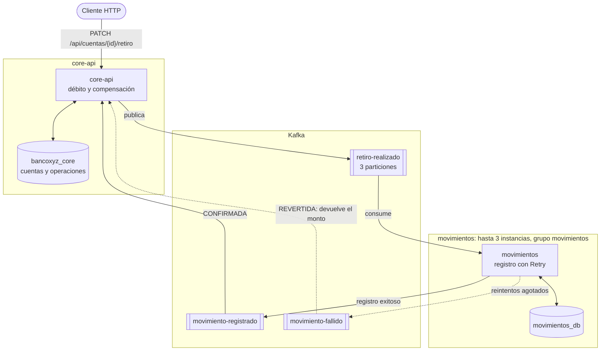

# BancoXYZ: microservicios con arquitectura de eventos (Exp3 S7, Grupo 11)

## Objetivo

Simulación bancaria construida con microservicios Spring Boot que se comunican mediante eventos en Kafka. El caso implementado es el **retiro de dinero**: core-api descuenta el saldo y el microservicio movimientos lo registra en su propia base de datos. Si movimientos no puede registrarlo, core-api **compensa** devolviendo el monto. La solución demuestra mensajería asíncrona, tolerancia a fallos con Resilience4j y escalabilidad horizontal del consumidor.

## Estructura del proyecto

| Módulo | Puerto | Responsabilidad |
|---|---|---|
| `config-server` | 8888 | Configuración centralizada (Spring Cloud Config, perfil `native`, archivos en `config-repo/`) |
| `service-registry` | 8761 | Registro y descubrimiento de servicios (Eureka) |
| `core-api` | 8080 (HTTPS) | Cuentas y retiros. Inicia la saga y ejecuta la compensación |
| `movimientos` | 8081 (HTTPS) | Registra cada retiro en su propia base de datos, con Retry de Resilience4j |
| `compose.yaml` | — | Kafka 4.2 (KRaft) con los tópicos creados, y PostgreSQL de movimientos (puerto 5433) |

Tecnologías: Java 21, Spring Boot 4.1, Spring Cloud 2025.1, Spring Kafka 4.1, Resilience4j 2.3, Flyway, PostgreSQL 18 y Docker.

Cada microservicio tiene su propia base de datos: core-api usa `bancoxyz_core` (PostgreSQL local) y movimientos usa `movimientos_db` (PostgreSQL en Docker). Las tablas se crean con migraciones Flyway al arrancar cada servicio.

## Arquitectura de eventos

### Patrón elegido: saga coreografiada con compensación

Una **saga** reemplaza una transacción que abarca varios servicios por una secuencia de transacciones locales, una por servicio, conectadas por eventos. Si un paso falla, se ejecuta una **transacción compensatoria** que deshace lo hecho en los pasos anteriores. En la variante **coreografiada**, no hay un servicio central que dirija el flujo: cada servicio reacciona a los eventos que le interesan y publica los suyos.

**Por qué este patrón para el retiro:**

- **El retiro involucra dos servicios con bases de datos separadas.** core-api descuenta el saldo en `bancoxyz_core` y movimientos registra el movimiento en `movimientos_db`. No existe una transacción de base de datos que abarque ambas, así que la consistencia se logra con compensación: si movimientos no puede registrar el retiro, core-api devuelve el monto.
- **Coreografía en vez de orquestación.** Con dos servicios y un solo flujo, un orquestador sería un servicio adicional sin beneficio real. La desventaja de la coreografía es que el flujo se vuelve difícil de seguir cuando crece; con este tamaño no es un problema.
- **Kafka como canal.** Los eventos quedan guardados: si movimientos está caído, el retiro no se pierde y se procesa cuando vuelve. Las particiones y los grupos de consumidores permiten repartir la carga entre varias instancias de movimientos.

**Por qué no Event Sourcing:** obligaría a reconstruir el saldo de cada cuenta a partir de sus eventos, lo que implica rediseñar cómo core-api guarda las cuentas. Para coordinar un retiro entre dos servicios, la saga resuelve el problema con un cambio mucho menor.

### Flujo

| # | Paso | Servicio |
|---|---|---|
| 1 | Descuenta el saldo, guarda la operación como `PENDIENTE` y publica `retiro-realizado` | core-api |
| 2 | Registra el movimiento en su base de datos | movimientos |
| 3a | Si lo logra, publica `movimiento-registrado`, y core-api marca la operación como `CONFIRMADA` | movimientos → core-api |
| 3b | Si falla tras agotar los reintentos, publica `movimiento-fallido`, y core-api **devuelve el monto** y marca la operación como `REVERTIDA` | movimientos → core-api |

core-api solo cambia el estado de una operación si sigue `PENDIENTE`. Así, si un evento llega repetido, se ignora y el monto nunca se devuelve dos veces. movimientos, por su parte, descarta los retiros duplicados usando el id de operación como clave única.

### Diagrama



Las líneas punteadas son el camino de la compensación.

### Tópicos y eventos

| Tópico | Particiones | Productor | Consumidor | Contenido |
|---|---|---|---|---|
| `retiro-realizado` | 3 | core-api | movimientos | `idOperacion`, `cuentaId`, `monto`, `fechaHora` |
| `movimiento-registrado` | 1 | movimientos | core-api | Los mismos campos |
| `movimiento-fallido` | 1 | movimientos | core-api | Los mismos campos, más `motivo` |

La clave de cada mensaje es el id de cuenta, para que los eventos de una misma cuenta se procesen en orden. El JSON viaja como texto y cada servicio lo convierte a su propia clase.

## Tolerancia a fallos (Resilience4j)

movimientos guarda cada movimiento protegido por un **Retry de Resilience4j** (`@Retry`). Los parámetros están en `config-repo/movimientos.properties`, no en el código:

| Parámetro | Valor | Motivo |
|---|---|---|
| `max-attempts` | 3 | Intentos antes de declarar el fallo |
| `wait-duration` | 2 s | Pausa entre intentos, para dar tiempo a que la base de datos se recupere |
| `retry-exceptions` | `DataAccessException` | Solo se reintentan errores de acceso a datos, que suelen ser transitorios |
| `ignore-exceptions` | `DataIntegrityViolationException` | Un error de integridad es de datos y no se resuelve reintentando |

Cuando se agotan los intentos, el método de *fallback* publica `movimiento-fallido` y core-api compensa el retiro.

**Prueba realizada** (evidencias, figuras 6 y 7): con el PostgreSQL de movimientos detenido, cada retiro se intenta registrar tres veces (unos 7 segundos entre intentos: 5 del timeout de conexión del pool más 2 de pausa). Luego se publica `movimiento-fallido` y core-api devuelve el monto y marca la operación como `REVERTIDA`. Al levantar la base de datos, los retiros vuelven a confirmarse normalmente.

## Escalabilidad

El tópico `retiro-realizado` tiene **3 particiones**. Todas las instancias de movimientos pertenecen al mismo grupo de consumidores (`movimientos`), así que Kafka reparte las particiones entre ellas y cada evento lo procesa una sola instancia.

**Prueba realizada** (evidencias, figuras 8 y 9): se levantaron tres instancias de movimientos (puertos 8081, 8082 y 8083), las tres registradas en Eureka. Kafka asignó una partición distinta a cada una. Al hacer retiros sobre varias cuentas, dos instancias procesaron eventos en paralelo: una la partición 2 (cuentas 101 y 103) y otra la partición 0 (cuentas 102, 107 y 108).

La partición 1 quedó sin mensajes porque Kafka asigna la partición según un hash de la clave (el id de cuenta), y ninguna de las seis cuentas existentes cae en ella. Es el comportamiento esperado del reparto por clave: con más cuentas, la tercera instancia también recibiría carga.

## Cómo ejecutar

### Requisitos

Java 21, PostgreSQL (probado con la versión 18) y Docker.

### 1. Crear la base de datos de core-api (una sola vez)

Flyway crea las tablas y carga los datos al arrancar core-api, pero no puede crear la base de datos misma.

**Linux:**

```bash
sudo -u postgres psql -c "CREATE USER core_user WITH PASSWORD 'core2026';"
sudo -u postgres psql -c "CREATE DATABASE bancoxyz_core OWNER core_user;"
```

**Windows (PowerShell):**

```powershell
psql -U postgres -c "CREATE USER core_user WITH PASSWORD 'core2026';"
psql -U postgres -c "CREATE DATABASE bancoxyz_core OWNER core_user;"
```

### 2. Levantar Kafka y la base de datos de movimientos

```bash
docker compose up -d
```

### 3. Arrancar los servicios

Cada uno en su propia terminal, desde la carpeta del módulo y en este orden: `config-server`, `service-registry`, `core-api`, `movimientos`.

| Sistema | Comando |
|---|---|
| Linux | `../mvnw spring-boot:run` |
| Windows | `..\mvnw.cmd spring-boot:run` |

Para levantar instancias adicionales de movimientos, se indica otro puerto:

```bash
../mvnw spring-boot:run -Dspring-boot.run.arguments=--server.port=8082
```

### 4. Probar

Todas las solicitudes a core-api y movimientos requieren la cabecera `X-Internal-Key`. Los certificados son autofirmados (en `curl`, opción `-k`; en Windows, usar `curl.exe`).

```bash
# Retiro: la respuesta incluye la cabecera X-Id-Operacion
curl -k -i -X PATCH -H "X-Internal-Key: clave-interna-bancoxyz-2026" -H "Content-Type: application/json" \
  -d '{"monto":10}' https://localhost:8080/api/cuentas/101/retiro

# Estado de las operaciones
psql -h localhost -U core_user -d bancoxyz_core -c 'SELECT id_operacion, monto, estado FROM operaciones'

# Probar la compensación: detener la base de datos de movimientos y repetir el retiro
docker stop postgres-movimientos
docker start postgres-movimientos

# Reparto de particiones entre las instancias de movimientos
docker exec kafka /opt/kafka/bin/kafka-consumer-groups.sh --bootstrap-server localhost:9092 --describe --group movimientos
```

## Retroalimentación aplicada de semanas anteriores

- **Sin BFF ni Batch**, según el alcance indicado para la Experiencia 3. Los datos que pobló el Batch se conservan como migración Flyway.
- **Esquema versionado con Flyway** en ambos microservicios.
- **Validación del retiro** (monto obligatorio, positivo y con hasta 2 decimales) y **errores en formato `ProblemDetail`** (RFC 9457), con `ResponseEntity` en los controladores.
- **Actuator** (`health`, `info`, `metrics`) protegido por la clave interna, y **pool de conexiones y timeouts** documentados en el Config Server.
- **core-api y movimientos registrados en Eureka.** La comunicación entre ambos es por Kafka, no por HTTP, así que no se usa descubrimiento para llamadas directas.
- **Parámetros del Retry externalizados** y reintento **solo ante errores transitorios**.

## Limitaciones conocidas

- **El monto usa `Double`.** Para dinero lo correcto es `BigDecimal`; se mantuvo `Double` por coherencia con el código existente.
- **Doble escritura en core-api:** el débito se guarda y luego se publica el evento. Si la publicación falla, queda un débito sin evento. La solución formal es el patrón *Transactional Outbox*.
- **Operaciones pendientes indefinidamente:** si movimientos nunca responde, la operación queda `PENDIENTE`. Se resolvería con un tiempo límite que dispare la compensación.
- **Credenciales en el repositorio:** contraseñas y claves están en los archivos de configuración, aceptable solo para desarrollo local.