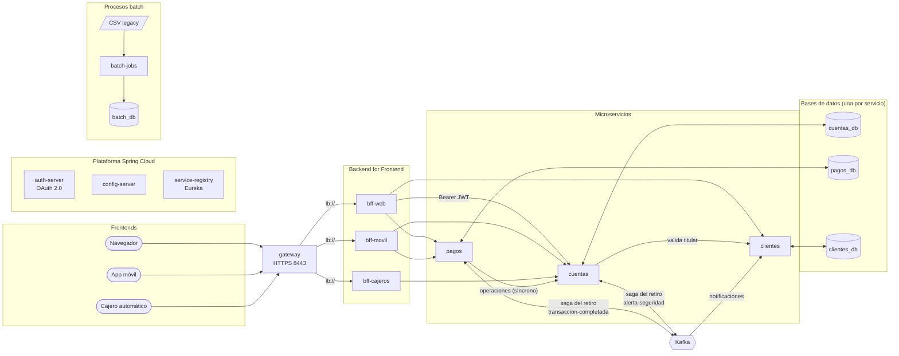

# BancoXYZ: modernización a microservicios con Spring Cloud y Spring Batch (EFT)

**Evaluación Final Transversal, Desarrollo Backend III (PBY2203). Actividad individual.** Autor: Diego Cruz

Banco XYZ opera hace más de 30 años sobre un sistema legacy (COBOL y scripts Shell en mainframe). Este proyecto lo reemplaza por una arquitectura de microservicios en contenedores, preparada para la nube, que cubre las tres partes del caso:

1. **Procesos batch** reescritos en Spring Batch: reporte de transacciones diarias, cálculo de intereses mensuales y estados de cuenta anuales, sobre los datos del sistema legacy ([fin_legacy_data](https://github.com/KariVillagran/fin_legacy_data)).
2. **Backend for Frontend** para web, móvil y cajeros automáticos, detrás de un gateway.
3. **Microservicios resilientes y seguros**: gestión de cuentas, procesamiento de pagos y gestión de clientes, con Spring Cloud Config, Eureka, OAuth 2.0, Resilience4j y Kafka.

Documentación de la entrega:

- [instrucciones.md](instrucciones.md): cómo ejecutar y probar cada componente.
- [despliegue.md](despliegue.md): cómo desplegar el sistema en AWS.

El proyecto continúa el trabajo de las semanas anteriores (Exp2: Batch y BFF; Exp3: Config Server, Eureka, saga con Kafka, OAuth 2.0 y contenedores).

## Arquitectura



En el diagrama se omiten, para que sea legible, las conexiones de todos los servicios con el Config Server (configuración), con Eureka (registro y descubrimiento) y con auth-server (tokens y claves públicas).

| Componente | Puerto | Responsabilidad |
|---|---|---|
| `gateway` | 8443 (HTTPS) | Punto de entrada único: enruta `/web/**`, `/movil/**` y `/cajero/**` al BFF del canal, con balanceo de carga |
| `bff-web` | 8091 (HTTPS) | Banca web: datos completos, apertura de cuentas, transferencias y resumen del cliente |
| `bff-movil` | 8092 (HTTPS) | App móvil: respuestas livianas, pagos y transferencias con límite por operación |
| `bff-cajeros` | 8093 (HTTPS) | Cajeros: consulta de saldo y retiro, con PIN y monto máximo por retiro |
| `cuentas` | 8080 (HTTPS) | Gestión de cuentas: apertura, cierre, consulta, retiro (saga) y operaciones solicitadas por pagos |
| `pagos` | 8081 (HTTPS) | Procesamiento de pagos: depósitos, pagos de servicios, transferencias y registro de los retiros de la saga |
| `clientes` | 8084 (HTTPS) | Gestión de clientes: perfiles y notificaciones generadas desde eventos de Kafka |
| `auth-server` | 9000 | Servidor de autorización OAuth 2.0: emite tokens JWT firmados (`client_credentials`) |
| `config-server` | 8888 | Configuración centralizada (Spring Cloud Config, carpeta `config-repo/` con perfil `docker`) |
| `service-registry` | 8761 | Registro y descubrimiento de servicios (Eureka) |
| `batch-jobs` | — | Tres procesos batch; se ejecuta y termina |
| `kafka` + `kafka-init` | 9092 | Mensajería de eventos (Kafka 4.2 en modo KRaft); `kafka-init` crea los tópicos |
| `postgres-*` | 5433 a 5436 | Una base de datos PostgreSQL por microservicio, más otra para el Batch |

Tecnologías: Java 21, Spring Boot 4.1, Spring Cloud 2025.1 (Config, Netflix Eureka, Gateway, LoadBalancer, CircuitBreaker), Spring Security 7 (servidor de autorización, resource server y cliente OAuth 2.0), Spring Batch 6, Spring Kafka 4.1, Resilience4j, Flyway, PostgreSQL 18 y Docker Compose.

## Procesos clave de la migración

| Proceso | Problema del legacy | Solución implementada |
|---|---|---|
| 1. Procesos batch a Spring Batch | Scripts monolíticos, sin reinicio ni trazabilidad de errores | Tres jobs con lectura, proceso y escritura; rechazos registrados; paralelismo; reejecución automática |
| 2. División del monolito en microservicios | Un módulo con problemas afecta a todo el sistema; escalar exige escalar todo | Tres servicios con base de datos propia, desplegados y escalados por separado |
| 3. Patrón BFF | Todos los canales reciben los mismos datos y dependen de los tiempos del backend | Un BFF por canal, independiente, con respuestas y reglas propias |
| 4. Seguridad distribuida | Seguridad centralizada y limitada | OAuth 2.0 con tokens JWT y scopes por endpoint; cada canal y servicio con sus credenciales; HTTPS en todas las APIs |
| 5. Mensajería asíncrona con Kafka | Integraciones acopladas y síncronas | Saga del retiro con compensación, notificaciones por transacción y alertas de seguridad |

## Microservicios

### cuentas (gestión de cuentas)

| Endpoint | Scope | Descripción |
|---|---|---|
| `GET /api/cuentas[?clienteId=]` | `cuentas.leer` | Lista todas las cuentas o las de un cliente |
| `GET /api/cuentas/{id}` | `cuentas.leer` | Detalle de la cuenta |
| `POST /api/cuentas` | `cuentas.administrar` | Apertura. Valida al titular en clientes (Circuit Breaker; si clientes no responde, responde 503 y no abre la cuenta) |
| `PATCH /api/cuentas/{id}/cierre` | `cuentas.administrar` | Cierre; exige saldo cero |
| `PATCH /api/cuentas/{id}/retiro` | `cuentas.retirar` | Retiro: inicia la saga con pagos (evento `retiro-realizado`) |
| `POST /api/cuentas/operaciones` | `cuentas.operar` | Depósito, pago o transferencia solicitado por pagos; idempotente por id de operación |
| `GET /api/transacciones` | `cuentas.leer` | Transacciones heredadas del Batch de la Exp2 |

- **Consistencia de saldos**: cada cargo es una sola sentencia condicionada (`saldo >= monto` y cuenta activa), y la tabla tiene la restricción `saldo >= 0`. Dos cargos simultáneos nunca dejan el saldo negativo.
- **Transferencias**: el débito y el crédito ocurren en una sola transacción local. Las dos cuentas se actualizan siempre en el mismo orden para evitar bloqueos mutuos entre transferencias cruzadas.
- **Idempotencia**: el id de operación lo genera pagos. Si pagos reintenta, cuentas reconoce el id y devuelve el resultado sin volver a mover dinero.
- **Alertas de seguridad**: retiros, pagos y transferencias desde 1000 (configurable) y el cierre de una cuenta publican un evento en `alerta-seguridad`.

### pagos (procesamiento de pagos)

| Endpoint | Scope | Descripción |
|---|---|---|
| `POST /api/pagos/depositos` | `pagos.operar` | Depósito |
| `POST /api/pagos/servicios` | `pagos.operar` | Pago de un servicio o comercio |
| `POST /api/pagos/transferencias` | `pagos.operar` | Transferencia entre cuentas |
| `GET /api/pagos[?cuentaId=&limite=]` | `pagos.leer` | Pagos de una cuenta (como origen o destino) |
| `GET /api/pagos/{idOperacion}` | `pagos.leer` | Detalle de un pago |
| `GET /api/movimientos[?cuentaId=]`, `GET /api/movimientos/{idOperacion}` | `pagos.leer` | Retiros registrados por la saga |

Cada pago queda registrado con su estado: `PENDIENTE` (enviado a cuentas), `COMPLETADO`, `RECHAZADO` (regla de negocio de cuentas: saldo insuficiente, cuenta cerrada...) o `FALLIDO` (cuentas no respondió). Si se completa, se publica `transaccion-completada`.

### clientes (gestión de clientes)

| Endpoint | Scope | Descripción |
|---|---|---|
| `GET /api/clientes`, `GET /api/clientes/{id}` | `clientes.leer` | Perfiles |
| `POST /api/clientes`, `PUT /api/clientes/{id}` | `clientes.escribir` | Registro y actualización (RUT único, validaciones de email, teléfono y fecha) |
| `GET /api/clientes/{id}/notificaciones` | `clientes.leer` | Notificaciones del cliente |

Consume `transaccion-completada` y `alerta-seguridad` y genera una notificación por evento. Los eventos repetidos se descartan con una clave única (Kafka puede entregar un mensaje más de una vez), y si la base de datos falla, el mensaje se reintenta 5 veces.

## Backend for Frontend

Los tres BFF son proyectos independientes. Cada uno tiene su configuración, su usuario de canal y su propio cliente OAuth 2.0, de modo que un equipo puede cambiar un canal sin tocar los demás. No dependen del arranque de los microservicios: si uno no está disponible, el BFF responde 503 o entrega datos parciales.

| | Web | Móvil | Cajeros |
|---|---|---|---|
| Ruta en el gateway | `/web/**` | `/movil/**` | `/cajero/**` |
| Autenticación del canal | Usuario y contraseña (Basic sobre HTTPS) | Usuario y contraseña (Basic sobre HTTPS) | Credencial del cajero (Basic) + PIN en `X-Pin` |
| Token hacia los servicios | `bff-web` | `bff-movil` | `bff-cajeros` |
| Scopes | Lectura y operación en los tres servicios, apertura de cuentas | Lectura de cuentas y pagos, operar pagos | Solo `cuentas.leer` y `cuentas.retirar` |
| Respuestas | Completas (todos los campos de la cuenta, el cliente y los pagos) | Livianas (cuenta: id, saldo, tipo y estado; movimiento: tipo, monto, estado y fecha) | Mínimas (cuenta y saldo) |
| Reglas propias | Resumen del cliente: combina los tres servicios en una respuesta, con degradación controlada | Límite de 2000 por operación | Máximo de 500 por retiro |

**Resumen del cliente** (`GET /web/clientes/{id}/resumen`): reúne perfil, cuentas, saldo total, últimos pagos y notificaciones. Si un servicio no responde, su sección queda vacía y se informa en `advertencias`; el resto del resumen se entrega igual.

## Seguridad

| Capa | Mecanismo |
|---|---|
| Canal → gateway → BFF | HTTPS de extremo a extremo; autenticación propia de cada canal (Basic, más PIN en cajeros) |
| BFF → microservicios y servicio → servicio | OAuth 2.0 `client_credentials`: cada BFF y cada servicio tiene su cliente y solo los scopes que necesita (mínimo privilegio) |
| Microservicios | Resource servers: validan por sí solos la firma (RS256), la vigencia (5 min), el emisor y el scope de cada token. Sin token: 401; sin scope: 403 |
| Certificado | Autofirmado, con SAN para `localhost` y los nombres de los servicios en Docker; el gateway y los clientes HTTP confían solo en él |
| Actuator | `health` público (lo usan los healthchecks de Docker), sin detalles; métricas y detalles solo con el scope `monitoreo` |

Clientes OAuth 2.0 registrados en `auth-server`:

| Cliente | Uso | Scopes |
|---|---|---|
| `bff-web`, `bff-movil`, `bff-cajeros` | BFF | Ver la tabla de BFF |
| `svc-pagos` | pagos → cuentas | `cuentas.operar` |
| `svc-cuentas` | cuentas → clientes | `clientes.leer` |
| `cliente-backoffice` | Pruebas directas (ejecutivo del banco) | `cuentas.leer`, `cuentas.administrar`, `clientes.leer`, `clientes.escribir`, `pagos.leer`, `pagos.operar` |
| `cliente-consulta` | Pruebas directas (reportes) | `cuentas.leer`, `pagos.leer`, `clientes.leer` |
| `cliente-cajero` | Pruebas directas (retiros) | `cuentas.leer`, `cuentas.retirar` |
| `cliente-monitoreo` | Operaciones | `monitoreo` |

## Resiliencia

| Dónde | Mecanismo | Comportamiento ante la falla |
|---|---|---|
| BFF → microservicios | Circuit Breaker por servicio (5 llamadas, 50 %), timeout de 6 s | Responde 503 de inmediato con el circuito abierto; el resumen web se degrada |
| pagos → cuentas | Retry (3 intentos, espera exponencial) + Circuit Breaker | Tras agotar los reintentos, el pago queda `FALLIDO` y se responde 503 indicando que no se movió dinero. Los rechazos de negocio (4xx) no se reintentan |
| cuentas → clientes (apertura) | Circuit Breaker | Rechaza la apertura (503): no se crea una cuenta sin titular verificado |
| cuentas → Kafka (retiro) | Retry + Circuit Breaker + compensación local | Si no se puede publicar el evento, devuelve el monto y responde 503 (S8) |
| pagos (registro del retiro) | Retry + evento `movimiento-fallido` | cuentas compensa la saga y devuelve el monto (S7) |
| clientes (consumidor Kafka) | Reintento del mensaje (5 × 2 s) y descarte de duplicados | No se pierde la notificación ante caídas breves de la base de datos |
| Contenedores | Healthchecks reales y `restart: unless-stopped` | Orden de arranque correcto y reinicio automático |

## Mensajería con Kafka

| Tópico | Particiones | Productor | Consumidor | Propósito |
|---|---|---|---|---|
| `retiro-realizado` | 3 | cuentas | pagos | Saga del retiro: registrar el movimiento |
| `movimiento-registrado` | 1 | pagos | cuentas | Saga: confirmar el retiro |
| `movimiento-fallido` | 1 | pagos | cuentas | Saga: compensar (devolver el monto) |
| `transaccion-completada` | 3 | pagos | clientes | Notificar depósitos, pagos y transferencias |
| `alerta-seguridad` | 1 | cuentas | clientes | Notificar montos elevados y cierres de cuenta |

La clave de cada mensaje es el número de cuenta: los eventos de una cuenta se procesan en orden. Con varias réplicas de pagos, Kafka reparte entre ellas las particiones de `retiro-realizado`.

## Procesos batch

| Job | Archivo legacy | Estrategia | Resultado |
|---|---|---|---|
| `transaccionesJob` | `movimientos_financieros_diarios.csv` | **Particionado**: 4 particiones en paralelo, cada una reanudable | `transacciones_diarias` + `resumen_transacciones_diarias` (por día: cantidad, totales de crédito y débito, monto máximo) |
| `interesesMensualesJob` | `intereses_trimestrales.csv` | **Un hilo, reanudable** desde el último commit (la primera aparición de una cuenta es la válida) | `intereses_calculados`, una fila por cuenta y período (mes) |
| `cuentasAnualesJob` | `estados_financieros_anuales.csv` | **Multihilo**: 4 hilos con un lector sincronizado | `cuentas_anuales` + `estados_cuenta_anuales` (por cuenta y año: totales por tipo y saldo neto) |

- **Manejo de errores**: el legacy contiene errores intencionales (montos negativos o vacíos, fechas en cuatro formatos, tipos inválidos, duplicados, edades fuera de rango). Las fechas válidas en cualquiera de los cuatro formatos se normalizan; el resto de los errores se omite (skip) y queda en `registros_rechazados` con un código y su motivo. El log verifica la integridad de cada paso: líneas = escritos + rechazados.
- **Reintentos**: las fallas temporales de la base de datos (`TransientDataAccessException`) se reintentan hasta 3 veces por bloque.
- **Finalización y reejecución** (`EjecutorDeJobs`):
  - La fecha de proceso identifica la ejecución: un job ya completado para esa fecha no se vuelve a procesar.
  - Un fallo técnico se reejecuta automáticamente (3 intentos, espera creciente): Spring Batch reanuda la misma instancia, salta lo ya completado y continúa desde el último commit.
  - Si se supera el límite de rechazos (fallo de calidad de datos), no se reintenta, porque el resultado sería el mismo.
  - Si un job no se completa, el proceso sale con código 1 y Docker reinicia el contenedor hasta 3 veces.
- **Escritura idempotente** (`ON CONFLICT DO NOTHING`): una reejecución no duplica filas.
- **Rendimiento**: bloques de 100 registros con inserciones por lotes (JDBC batch), particiones y pasos multihilo.

Resultados esperados con el set `semana_3` (1000 registros por archivo), calculados aplicando las mismas reglas al archivo de entrada:

| Job | Escritos | Rechazados | Rechazos por código |
|---|---|---|---|
| `transaccionesJob` | 392 (resumen de 239 días) | 608 | `TIPO_INVALIDO` 256, `MONTO_VACIO` 162, `MONTO_NO_POSITIVO` 141, `FORMATO_INVALIDO` 49 (mes 13) |
| `interesesMensualesJob` | 50 (interés total 4220,00) | 950 | `DUPLICADO` 372, `SALDO_VACIO` 204, `TIPO_INVALIDO` 200, `EDAD_VACIA` 132, `EDAD_FUERA_DE_RANGO` 42 |
| `cuentasAnualesJob` | 497 (20 estados de cuenta) | 503 | `MONTO_NO_POSITIVO` 348, `DESCRIPCION_VACIA` 107, `MONTO_VACIO` 48 |

Supuestos, porque el legacy no documenta sus reglas:

- **Tasas mensuales**: ahorro 0,5 %, préstamo 1,5 % e hipoteca 0,8 % (se trata como préstamo hipotecario).
- **Monto de los movimientos anuales**: debe ser positivo. El tipo indica si suma o resta, y el README de los datos declara los montos negativos como errores.
- **Fechas con el día primero** (`dd-MM-aaaa`): se verificó en los datos que el primer número supera 12 en cientos de filas y el segundo nunca.

## Escalabilidad horizontal

`cuentas`, `pagos` y `clientes` no tienen nombre de contenedor fijo y se pueden levantar con varias réplicas:

```zsh
docker compose -f docker-compose.yaml -f docker-compose.escalado.yaml up -d \
  --scale cuentas=2 --scale pagos=2 --scale clientes=2
```

Cada réplica se registra en Eureka con su propia IP y un id único. El gateway, los BFF y los servicios reparten las solicitudes entre las réplicas (Spring Cloud LoadBalancer), y Kafka reparte las particiones entre los consumidores del mismo grupo. Las réplicas comparten la base de datos de su servicio. El pool de 10 conexiones por réplica permite unas 9 réplicas antes de llegar al límite de 100 conexiones de PostgreSQL.

## Monitoreo y registro

- **Eureka** (`http://localhost:8761`): instancias registradas y su estado.
- **Actuator**: `health` en todos los servicios; `info`, `metrics` y detalles de salud con el scope `monitoreo`; rutas del gateway en `/actuator/gateway/routes`.
- **Logs con identificador**: cada operación registra su `idOperacion` en cuentas, pagos y clientes, para seguir una transacción entre servicios. También quedan en el log los cambios de estado de los Circuit Breakers, las alertas y el resumen de cada job batch.
- **Trazabilidad del Batch**: metadatos de Spring Batch (`batch_job_execution`, `batch_step_execution`) y `registros_rechazados`.

## Decisiones y limitaciones

- **Verificación de host en llamadas internas**: con réplicas, Eureka entrega IPs que Docker asigna dinámicamente, y un certificado autofirmado no puede incluirlas. Por eso los clientes HTTP internos confían solo en el certificado del proyecto, pero no verifican el nombre de host. En producción se usarían certificados emitidos por una CA interna o una malla de servicios con mTLS.
- **Secretos**: los secretos están en texto plano (`{noop}`) en la configuración, lo que solo es aceptable en este entorno académico. En AWS irían en Secrets Manager (ver [despliegue.md](despliegue.md)).
- **Notificaciones best effort**: si pagos completa un pago pero Kafka no está disponible, el pago queda bien registrado, pero la notificación se pierde. El patrón *outbox transaccional* lo resolvería.
- **Pago sin confirmación**: si cuentas aplica una operación pero la respuesta no llega a pagos (timeout), el pago queda `FALLIDO` aunque el dinero se haya movido. Los reintentos usan el mismo id de operación, por lo que no se duplica; queda pendiente un proceso de conciliación.
- **Usuarios de los canales**: están en memoria, uno por canal. En producción se autenticaría a cada cliente final (por ejemplo, con OAuth 2.0 *authorization code*).
