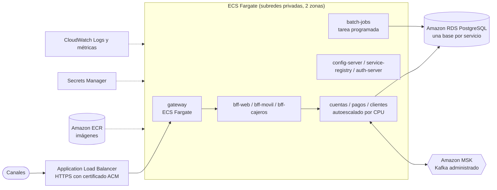

# Despliegue en la nube (AWS)

Este documento describe cómo desplegar BancoXYZ en Amazon Web Services. Se presentan dos niveles:

1. **Despliegue directo en EC2 con Docker Compose**: reproduce en la nube el mismo entorno que se ejecuta localmente, con los mismos archivos. Es el procedimiento paso a paso.
2. **Arquitectura objetivo con servicios administrados** (ECR, ECS Fargate, RDS, Amazon MSK, ALB): cómo evolucionaría el despliegue en producción y qué cambia en la configuración.

> Los nombres de menús, tipos de instancia y comandos de AWS corresponden a la documentación vigente al momento de escribir este documento. Conviene contrastarlos con la consola de AWS antes de ejecutarlos. Todos los recursos generan costos mientras estén encendidos.

## Qué hace que el proyecto esté preparado para la nube

| Característica | Dónde está |
|---|---|
| Una imagen Docker por servicio (construcción en dos etapas, usuario sin privilegios) | `*/Dockerfile` |
| Orquestación declarativa con orden de arranque por healthchecks | `docker-compose.yaml` |
| Configuración externa por entorno (perfil `docker`, variables de entorno) | `config-server/src/main/resources/config-repo/*-docker.properties` y `environment:` del compose |
| Servicios sin estado y escalables horizontalmente (registro por IP en Eureka) | `docker-compose.escalado.yaml` |
| Healthchecks HTTP (`/actuator/health`) para el orquestador o un balanceador | `docker-compose.yaml` |
| Esquemas de base de datos versionados con Flyway (se crean solos al arrancar) | `*/src/main/resources/db/migration` |
| Único punto de entrada HTTPS (gateway, puerto 8443) | `gateway` |

## 1. Despliegue en EC2 con Docker Compose

### 1.1 Recursos

| Recurso | Configuración |
|---|---|
| Instancia EC2 | Amazon Linux 2023, `t3.xlarge` (4 vCPU, 16 GB de RAM). Son 11 procesos Java, 4 PostgreSQL y Kafka; con menos de 8 GB los servicios compiten por memoria |
| Almacenamiento | Volumen EBS gp3 de 30 GB (imágenes Docker, caché de Maven y volúmenes de las bases de datos) |
| Par de claves | Para conectarse por SSH |
| Grupo de seguridad | Entrada: TCP 22 solo desde tu IP; TCP 8443 (gateway) desde donde se usarán los canales; opcional TCP 8761 (Eureka) solo desde tu IP, para la demostración. Ningún otro puerto abierto |
| IP elástica (opcional) | Dirección fija para el gateway |

Solo el gateway queda expuesto. Las bases de datos, Kafka, los microservicios y la plataforma Spring Cloud se comunican por la red interna de Docker y no son accesibles desde internet. Los puertos que el compose publica en la instancia quedan bloqueados por el grupo de seguridad.

### 1.2 Crear la instancia

1. En la consola de AWS: **EC2 → Instances → Launch instances**.
2. Nombre `bancoxyz`, AMI **Amazon Linux 2023**, tipo `t3.xlarge`, el par de claves y un grupo de seguridad nuevo con las reglas de la tabla anterior.
3. Almacenamiento: 30 GB gp3. Lanzar la instancia y anotar su IP pública.

### 1.3 Instalar Docker, Compose y Git

```zsh
ssh -i bancoxyz.pem ec2-user@<IP_PUBLICA>

sudo dnf update -y
sudo dnf install -y docker git
sudo systemctl enable --now docker
sudo usermod -aG docker ec2-user
exit    # volver a entrar para que el grupo docker tenga efecto
```

El paquete `docker` de Amazon Linux no trae los plugins de Compose ni Buildx (Compose los necesita para `--build`). Se instalan desde sus versiones publicadas en GitHub:

```zsh
ssh -i bancoxyz.pem ec2-user@<IP_PUBLICA>

sudo mkdir -p /usr/local/lib/docker/cli-plugins
sudo curl -SL https://github.com/docker/compose/releases/latest/download/docker-compose-linux-x86_64 \
  -o /usr/local/lib/docker/cli-plugins/docker-compose
BUILDX=$(curl -s https://api.github.com/repos/docker/buildx/releases/latest | grep -m1 '"tag_name"' | cut -d'"' -f4)
sudo curl -SL https://github.com/docker/buildx/releases/download/${BUILDX}/buildx-${BUILDX}.linux-amd64 \
  -o /usr/local/lib/docker/cli-plugins/docker-buildx
sudo chmod +x /usr/local/lib/docker/cli-plugins/docker-compose /usr/local/lib/docker/cli-plugins/docker-buildx

docker compose version   # debe ser 2.24 o superior
docker buildx version
```

### 1.4 Obtener el proyecto y configurar el entorno

```zsh
git clone https://github.com/dcruz-00/PBY2203-bancoxyz-microservicios.git
cd PBY2203-bancoxyz-microservicios
```

Antes de exponer el sistema en internet hay que reemplazar los valores de demostración:

| Valor | Archivo | Qué hacer |
|---|---|---|
| Secretos de los clientes OAuth (`{noop}...`) | `auth-server/src/main/resources/application.properties` y `config-repo/*.properties` | Generar secretos aleatorios (por ejemplo `openssl rand -base64 24`) y guardarlos cifrados con `{bcrypt}` en auth-server |
| Usuarios de los canales (`bff.usuario`, `bff.clave`) y PIN | `config-repo/bff-*.properties` | Cambiar por valores propios |
| Contraseñas de PostgreSQL | `docker-compose.yaml` y `config-repo/*.properties` | Cambiar en ambos lugares |
| Certificado autofirmado | `bancoxyz-keystore.p12` de cada servicio | Para el gateway, usar un certificado emitido por una CA (por ejemplo, Let's Encrypt para un dominio propio) o, en la arquitectura objetivo, terminar TLS en un ALB con ACM |

En este proyecto académico los secretos están en los archivos para que la revisión sea reproducible. En AWS, el paso siguiente es moverlos a **AWS Secrets Manager** o **SSM Parameter Store** y entregarlos como variables de entorno (sección 2).

### 1.5 Levantar el sistema

```zsh
docker compose up -d --build
docker compose ps -a
```

La primera construcción en la instancia tarda varios minutos (descarga de dependencias de Maven). Cuando todos los servicios estén `healthy`, verificar desde tu equipo:

```zsh
curl -sk -u web-client:web-secret https://<IP_PUBLICA>:8443/web/clientes/1/resumen
```

Todas las pruebas de [instrucciones.md](instrucciones.md) que pasan por el gateway funcionan igual, reemplazando `localhost:8443` por `<IP_PUBLICA>:8443`. Las pruebas directas a los microservicios se ejecutan en la instancia (por SSH), porque sus puertos no están abiertos en el grupo de seguridad.

### 1.6 Escalar horizontalmente en la instancia

```zsh
docker compose -f docker-compose.yaml -f docker-compose.escalado.yaml up -d \
  --scale cuentas=2 --scale pagos=2 --scale clientes=2
```

Las réplicas se registran en Eureka y el gateway, los BFF y los servicios reparten las solicitudes entre ellas. En una sola instancia esto mejora la tolerancia a fallas de un proceso, pero no la de la máquina. Para eso se usa la arquitectura de la sección 2, con instancias en varias zonas de disponibilidad.

### 1.7 Operación

| Tarea | Comando |
|---|---|
| Ver logs de un servicio | `docker compose logs -f pagos` |
| Reiniciar los procesos batch | `docker compose run --rm batch-jobs` |
| Actualizar a una nueva versión | `git pull && docker compose up -d --build` |
| Detener | `docker compose down` (conserva los datos) |
| Ejecución diaria del Batch | Tarea de cron en la instancia, por ejemplo `0 2 * * * cd ~/PBY2203-bancoxyz-microservicios && docker compose run --rm batch-jobs`; o, en la arquitectura objetivo, una tarea programada de ECS (EventBridge Scheduler) |

Para no perder datos si se reemplaza la instancia, respaldar los volúmenes o, mejor, usar Amazon RDS (sección 2).

## 2. Arquitectura objetivo en AWS (producción)



| Componente local | Servicio de AWS | Motivo |
|---|---|---|
| Imágenes construidas localmente | **Amazon ECR** | Registro privado de imágenes, versionadas por etiqueta |
| Contenedores en una máquina | **Amazon ECS con Fargate** | Cada microservicio es un servicio ECS con su número de tareas (réplicas) y autoescalado; sin administrar servidores |
| `postgres-*` | **Amazon RDS for PostgreSQL** (Multi-AZ) | Respaldos automáticos, alta disponibilidad y parches administrados |
| `kafka` | **Amazon MSK** | Kafka administrado con replicación entre zonas (factor de replicación 3) |
| Puerto 8443 del gateway | **Application Load Balancer** + **ACM** | Certificado de confianza pública, terminación TLS y verificación de salud de las tareas |
| Secretos en archivos | **AWS Secrets Manager** | Secretos cifrados, inyectados como variables de entorno en las tareas |
| Logs en consola | **Amazon CloudWatch** | Logs centralizados (driver `awslogs`), métricas y alarmas |
| Batch al levantar el compose | **Tarea de ECS programada con EventBridge Scheduler** | Ejecución diaria del Batch; la política de reejecución del propio Batch se mantiene |

### 2.1 Publicar las imágenes en ECR

```zsh
export AWS_REGION=us-east-1
export CUENTA=$(aws sts get-caller-identity --query Account --output text)
export REGISTRO=$CUENTA.dkr.ecr.$AWS_REGION.amazonaws.com

aws ecr get-login-password --region $AWS_REGION | docker login --username AWS --password-stdin $REGISTRO

for s in config-server service-registry auth-server gateway cuentas pagos clientes bff-web bff-movil bff-cajeros batch-jobs; do
  aws ecr create-repository --repository-name bancoxyz/$s --region $AWS_REGION >/dev/null 2>&1
  docker build -f $s/Dockerfile -t $REGISTRO/bancoxyz/$s:1.0.0 .
  docker push $REGISTRO/bancoxyz/$s:1.0.0
done
```

### 2.2 Cambios de configuración

La configuración ya está separada por perfil, así que el despliegue en AWS se resuelve con un perfil `aws` en el `config-repo` (o con variables de entorno en cada definición de tarea), sin cambiar el código:

| Propiedad | Valor en AWS |
|---|---|
| `spring.datasource.url` / `username` / `password` | Endpoint de RDS; usuario y contraseña desde Secrets Manager |
| `spring.kafka.bootstrap-servers` | Brokers de MSK (con TLS: `spring.kafka.security.protocol=SSL`) |
| `spring.security.oauth2.resourceserver.jwt.issuer-uri` y `AUTH_ISSUER` | URL interna fija de auth-server (por ejemplo, con ECS Service Connect: `http://auth-server:9000`) |
| `eureka.client.service-url.defaultZone` | URL interna de service-registry |
| Réplicas de Kafka (`kafka-init`) | Factor de replicación 3 en los tópicos |

Para el descubrimiento de servicios se mantiene Eureka, porque el código ya lo usa para el balanceo de carga. Una alternativa nativa sería ECS Service Connect o AWS Cloud Map, reemplazando `lb://` por nombres DNS internos.

### 2.3 Escalado horizontal en ECS

Cada microservicio es un servicio ECS con `desiredCount` inicial de 2 tareas, distribuidas en dos zonas de disponibilidad, y una política de autoescalado por seguimiento de objetivo:

```zsh
aws application-autoscaling register-scalable-target \
  --service-namespace ecs --scalable-dimension ecs:service:DesiredCount \
  --resource-id service/bancoxyz/pagos --min-capacity 2 --max-capacity 6

aws application-autoscaling put-scaling-policy \
  --service-namespace ecs --scalable-dimension ecs:service:DesiredCount \
  --resource-id service/bancoxyz/pagos --policy-name pagos-cpu-60 \
  --policy-type TargetTrackingScaling \
  --target-tracking-scaling-policy-configuration \
  '{"TargetValue":60.0,"PredefinedMetricSpecification":{"PredefinedMetricType":"ECSServiceAverageCPUUtilization"}}'
```

Las nuevas tareas se registran solas en Eureka y empiezan a recibir tráfico. Como los tópicos tienen 3 particiones, hasta 3 réplicas de pagos consumen `retiro-realizado` en paralelo; para más réplicas hay que aumentar las particiones.

### 2.4 Lista de verificación del despliegue

- [ ] Imágenes publicadas en ECR con una etiqueta de versión.
- [ ] RDS creado (una base por servicio) y accesible solo desde el grupo de seguridad de las tareas.
- [ ] MSK creado y tópicos con factor de replicación 3.
- [ ] Secretos en Secrets Manager y referenciados en las definiciones de tarea.
- [ ] ALB con certificado ACM apuntando al gateway; healthcheck en `/actuator/health`.
- [ ] Servicios ECS con 2 o más tareas en dos zonas y autoescalado configurado.
- [ ] Logs en CloudWatch y alarmas para tareas no saludables y errores 5xx del ALB.
- [ ] Tarea programada del Batch y alarma si termina con código distinto de 0.
